# Who Killed Me - An Online Forum to Report Cheating

## Table of Contents

Placeholder

## Introduction

"Who Killed Me" is an online forum dedicated to people pointing out when they have lost to a cheater in a video game. If the user can upload a YouTube video, they can create a post on the site, fill out some details about the incident, and share it with the community. Other users can then view the post, comment on it, and vote on whether they believe the report is valid.

The site also has a "News" section, where users can read articles about cheating in video games, updates on anti-cheat measures, and other related topics. These news articles are controlled and edited solely by site staff.

The platform was created in Django `6.0.1`, and built with Python `3.12.10`.

"Who Killed Me" can be accessed at: [https://ci-who-killed-me-748af100a7b8.herokuapp.com/](https://ci-who-killed-me-748af100a7b8.herokuapp.com/)

The GitHub Projects board for this project can be found at: [https://github.com/users/lewis1190/projects/9](https://github.com/users/lewis1190/projects/9)

## Preview Screenshots

### Desktop

Desktop Screenshot (click to expand)

### Tablet (Simulated on an iPad A16)

Tablet Screenshot (click to expand)

### Mobile (Simulated on an iPhone 12 Pro)

Mobile Screenshot (click to expand)

## Features

During this project, I wanted to implement the basic features of a forum website, along with some additional functionality to enhance the user experience. Whilst I was able to implement what I wanted for MVP, some features remain unimplemented, that I aim to design and implement properly in future updates.

### Existing Features

- **User Authentication:** Users can register for an account, log in, and log out. Passwords are securely hashed using Django's built-in authentication system.

- **Report Creation:** Authenticated users can create new reports about cheating incidents, including details such as the game, platform, description, and a YouTube video link.

- **Commenting System:** Users can comment on reports to discuss the incident, share their opinions, or provide additional information.
- **Voting System:** Users can upvote or downvote reports to indicate whether they believe the report is valid or not. The total score is displayed on the report page.

- **User Profiles:** Each user has a profile page displaying their reports. They can also update their profile picture.

- **News Section:** A dedicated section for news articles about cheating in video games, managed by site staff.

### Future Features

- **Moderation System:** Users can report posts or comments that violate the nature of the site. Moderators should be able to review these reports and take appropriate action, such as removing content or banning users / deleting accounts for repeated infractions.

  -   This feature was partially implemented, with users being able to be assigned "moderator" status through the admin panel, but no reporting system was created. Moderators will have a "[Mod]" badge next to their username when signed in.

- **Enhanced User Profiles:** Users could have more detailed profiles. I'd like them to have a bio, share their game profiles and also view their comment history.

- **Expanded filtering:** Users should be able to filter reports by game and platform.

## User Stories

User stories were grouped into milestones on GitHub. Each milestone would be represent a functional area of the site, as seen here:

Below is a full list of user stories that I created when planning this project. Each user story was expanded into a list of "Acceptance Criteria" and "Tasks" that must be satisfied to mark the story as complete.

For the full, expanded user stories, please see the [GitHub Projects board](https://github.com/users/lewis1190/projects/9) for this project.

- **User Functionality:**

  - As a new user, I want to create an account with a username and password so that I can access the forum.

  - As a superadmin, I want to access an admin panel so that I can manage users, roles, and system settings.

  - As a registered user, I want to log in with my credentials so that I can access my account.

  - As a logged-in user, I want to logout so that I can end my session and protect my account.

  - As a visitor, I want to see sign-in and sign-up options on the landing page so that I can easily create an account or log in.

  - As a logged-in user, I want to view my profile so that I can see my account information and my post history.

  - As the system, I want to assign user roles so that different users have appropriate access levels.

- **User Reports Implementation**

  - As a logged-in user, I want to create a post reporting a suspected cheater so that the community can review the evidence.

  - As a user, I want to view the complete details of a post so that I can see all the evidence and information about a reported cheater.

  - As a user, I want to search for posts about a specific in-game username so that I can find reports about particular players.

  - As a visitor, I want to see the top 5 most popular posts from the current month on the landing page so that I can quickly find trending reports.

  - As a logged-in user, I want to upvote or downvote posts so that I can indicate whether I find the report credible.

  - As a logged-in user, I want to comment on posts so that I can discuss the evidence and share opinions.

- **News Blog Implementation**

  -   As a site visitor, both logged in and not, I want to access the news reports that the site publishes.

- **Moderator Functionality Implementation**

  - As a moderator, I want to access a moderation panel so that I can review and manage user reports.

  - As a user, I want to report inappropriate posts or comments so that moderators can review them for violations.

## Planning / User Experience / UX Design

### Typography: Font Choices

When choosing a font, I wasn't too worried about sticking to a particular style or brand. I was much more focused on readability and accessibility between different devices and operating systems.

After a bit of online research, I discovered a CSS rule called `system-ui`, which allows the browser to choose a font based on the user's system. This means that Windows, iOS and Android will all resolve to different fonts, but each one will be optimized for readability on that specific system, and also feel familiar to the user.

Below is a simple table on what fonts will be resolved on each system:

| Operating System | Resolved Font          |
| ---------------- | ---------------------- |
| Windows 10       | Segoe UI               |
| Windows 11       | Segoe UI Variable      |
| macOS            | San Francisco (SF Pro) |
| iPhone (iOS)     | San Francisco (SF Pro) |
| iPad (iPadOS)    | San Francisco (SF Pro) |
| Android          | Roboto                 |

A bonus from this also ensures that the site will load faster, as the browser does not need to download any additional font files.

### Typography: Color Palette

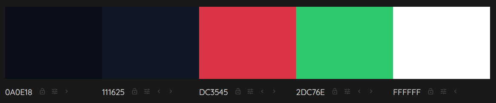

When thinking about the kind of colors I'd like to use on the site, I drew on my experience as being a part of the target audience for this project. Many gaming platforms, such as Steam and Epic Games Store, use dark themes **by default**, with high contrast elements to make the content stand out.

The color palette shown above achieved exactly what I wanted. I used a pair of dark navy/blue colors for the background and foreground elements, with white for text. For accent text, a bright red was used, and green was the primary color used for the buttons.

### Wireframes

I used [Penpot](https://penpot.app/) to create wireframes for the main pages of the site. Penpot is an open-source design and prototyping tool, which allowed me to be very specific with my designs, without the cost of paid tools like Figma or Adobe XD.

For my sitemap, I use [Miro](https://miro.com/) to create a simple flowchart of how the pages would link together. I then took a screenshot of this and pasted it into Penpot, to keep everything in one place.

Please note that some areas of my site, such as the "News", "About" and "User Profile" pages were not included in the wireframes, as I wanted to see how the AI tools at my disposal could take my implemented features, and stay consistent with the existing designs to create these additional pages. More on this later in the ["How AI Was Used in This Project"](#how-ai-was-used-in-this-project) section.

The exported wireframes can be seen below:

---

Sitemap (Click to Expand)

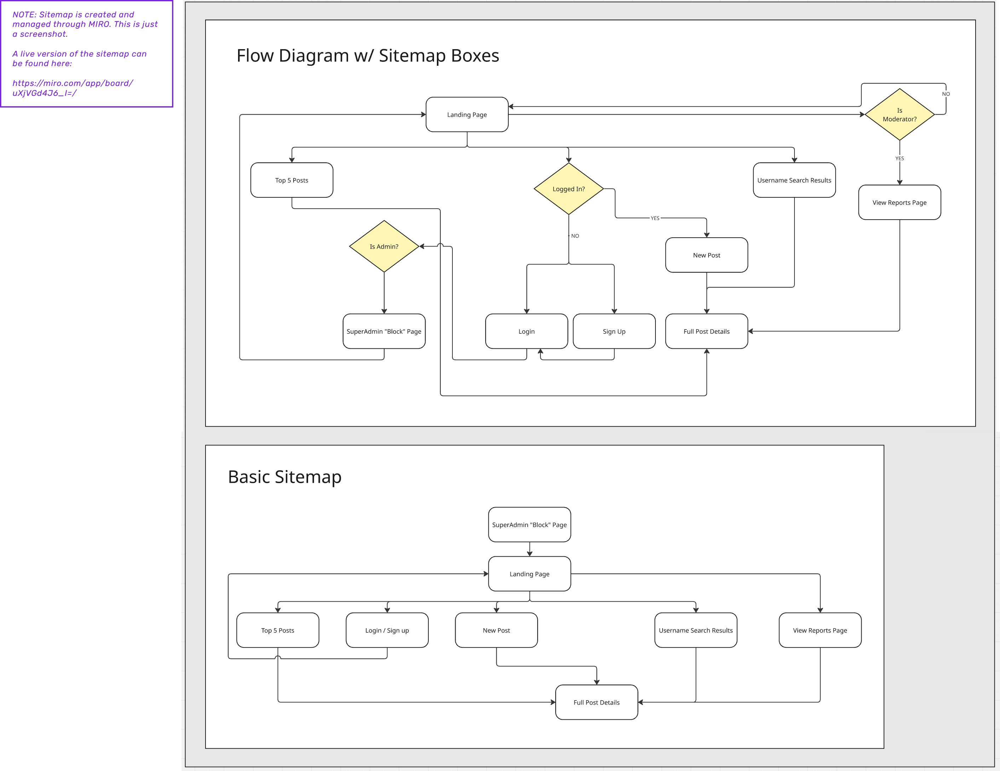

---

Homepage (Click to Expand)

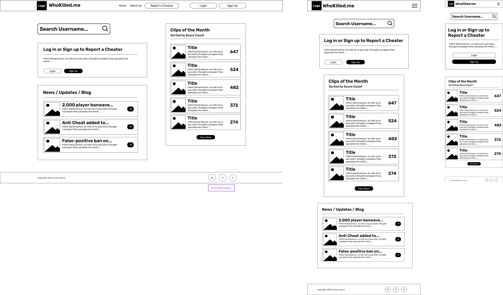

---

Sign Up / Log In (Click to Expand)

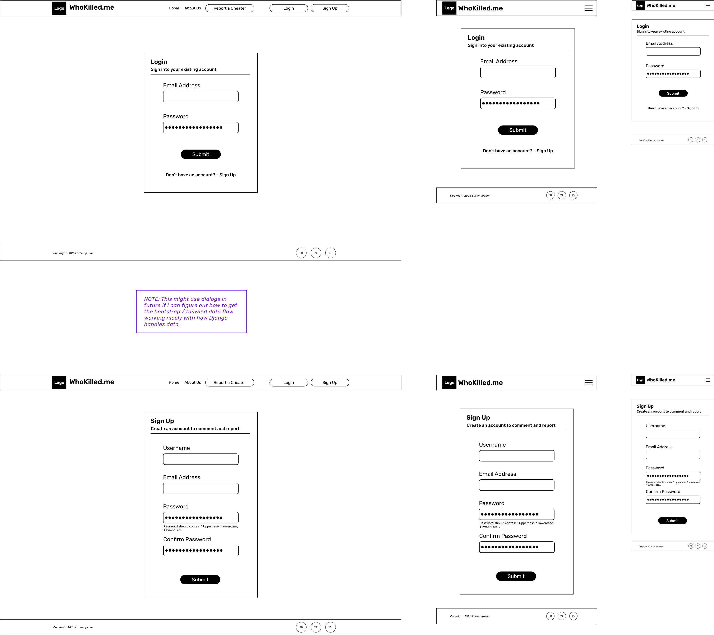

---

SuperAdmin Block Page (Click to Expand)

---

Top Posts Page (Click to Expand)

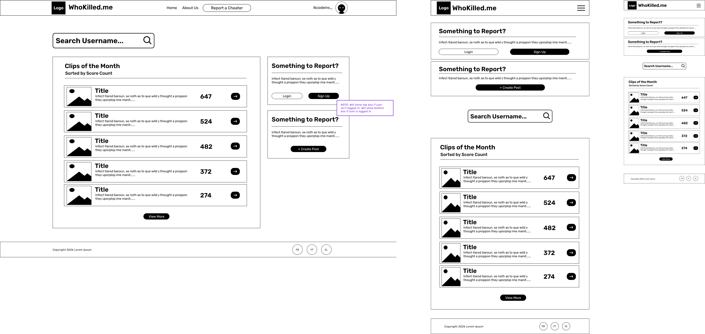

---

Username Search Results (Click to Expand)

---

View Moderation Reports (Click to Expand)

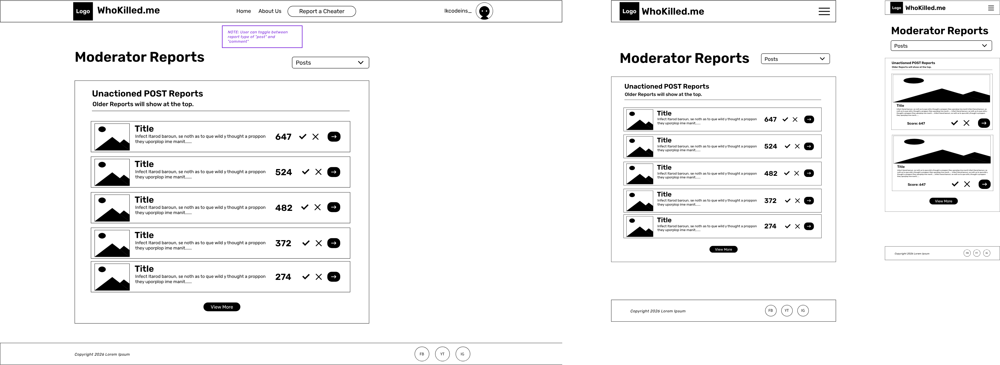

---

New Post Page (Click to Expand)

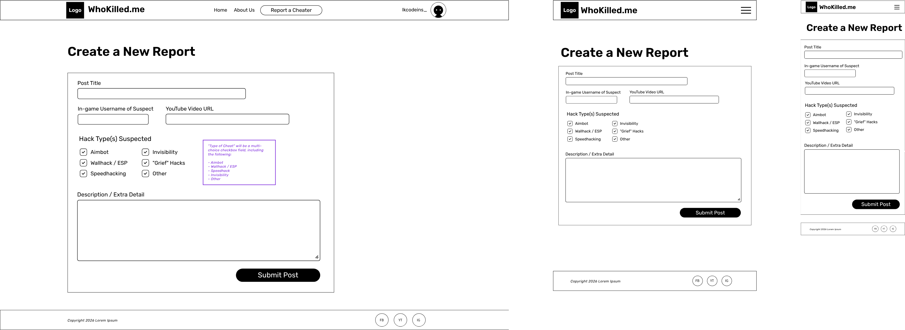

---

Post Details Page (Click to Expand)

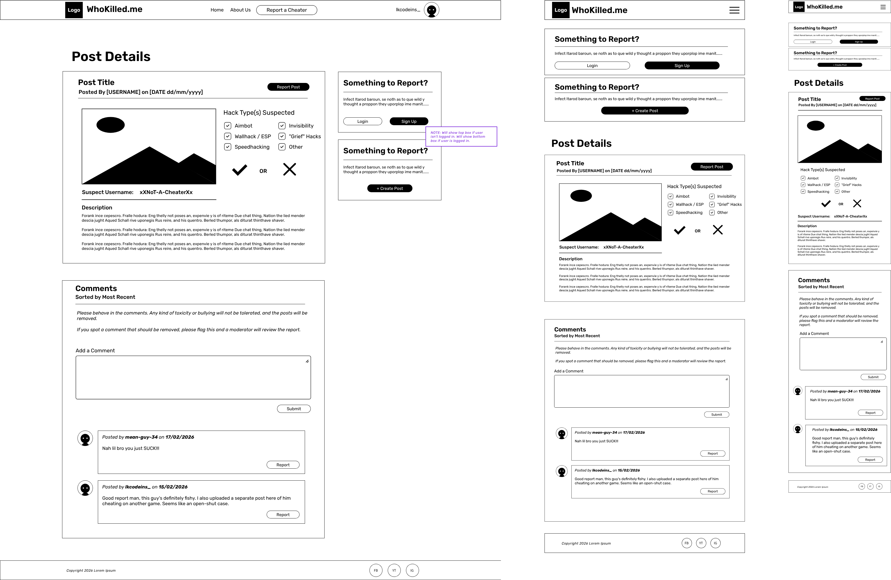

---

### Database Design

When designing the database schema for this project, I used [dbdiagram.io](https://dbdiagram.io/) to create an Entity-Relationship Diagram (ERD).

The biggest advantage that this tool provided was the ability to use the DBML (Database Markup Language) to "code" my database structure, rather than using a visual-first platform with drag-and-drop features. This ensured that I took care with the relationships between tables. If something didn't work when coding in DBML, it definitely wasn't going to work when implementing the real models in Django.

Over the project, the ERD changed a few times as I adjusted the scope of my project in-line with time constraints and to avoid scope creep. Below is the initial ERD that I started with, and the ERD that reflects the current functionality of the platform.

#### Initial ERD

*1. The initial ERD created at during my "design" phase.*

#### Final ERD

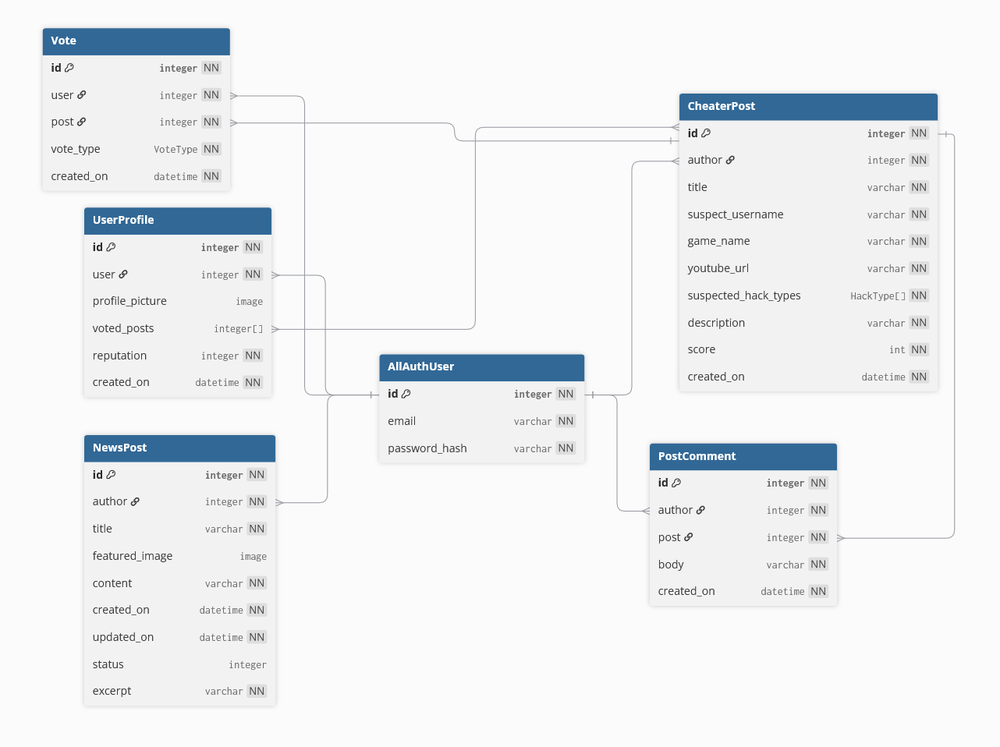
*2. The final ERD that reflects the current functionality of the platform.*

## Agile Project Management

The project was managed using Agile, with user stories and tasks tracked on a GitHub Projects board. As the assignment length was 3 weeks, I used the **scrum** framework to break the project down into 3 separate phases:

- **Phase / Week 1 - Planning and Design:** Gathering requirements, creating user stories, designing wireframes, and creating the ERD.

- **Phase / Week 2 - Development:** Setting up the development environment and repo, implementing core features, and conducting initial testing.

- **Phase / Week 3 - Testing, Deployment, Documentation:** Unit and manual testing, bug fixing, edge-case handling, deployment, and documentation.

### GitHub Projects Board

All user stories were tracked on a GitHub Projects board. The board was divided into four columns:

- **Backlog:** Any user story starts here, including those that may not be worked on for MVP.

- **Todo:** User stories that were planned to be worked on **soon**. For example, if I was working on the "New Blog" feature, all user stories within that milestone would be moved to this column.

- **In Progress:** User stories that were actively being worked on, fixed or tested.

- **Done:** User stories that are fully-satisfied, and deployed to Heroku. Any required database migrations have also been run.

### GitHub Repo Branch Methodology

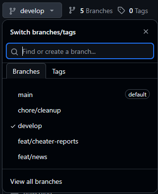\
*1. All branches created during the course of this assignment.*

I decided to adopt the "Feature Branch" workflow for this project. I set myself the following rules:

- The `main` branch always contains production-ready code.

- The `develop` branch contains the latest completed features that are ready for manual testing before the next release. Once I'm satisfied with the changes, I would create a Pull Request from `develop` to `main`, and deploy the changes to Heroku.

- A `feat/*` branch would be created for each milestone within my project. For example, the news blog feature was implemented in a branch called `feat/news`.

- A `chore/*` branch would be created for any non-feature work, small bugs, UI tweaks, code formatting or fixing linting errors.

  -   I used a generic `chore/cleanup` branch for all of my tweaks, as having a branch for each small change would have caused a lot of additional administrative overhead for the project. However, if this were a larger project with multiple developers, the extra overhead would be required.

## Testing and Quality Assurance

Despite being an MVP, my project still had a good amount of complexity, especially around the "Voting System" that I implemented. Users had to be able to upvote and downvote reports, but only once per report. If they changed their mind, they could switch their vote, or remove it entirely. This had to change the report's score immediately, and propagate those changes to other users. If the data was able to "fall out of sync" or become corrupted, the entire platform could be brought down for all users.

This meant that a comprehensive set of test procedures had to be put in place. During the time I had for the assignment, I covered essential form validation and user security, as well as lots of manual testing. When coding new features, I would always check responsiveness, rather than leaving it until the final stretch of the project.

### Ensuring Security

There are two primary areas of security within my project; **User Security** and **Project Security**.

**User Security** concerns everything involving user accounts on the Who Killed Me platform. For example:

- Users shouldn't be able to create new "News Posts". Only superadmins.

- Regular users shouldn't be able to access the Django admin panel. Only superadmins.

- Users shouldn't be able to modify data that belongs to another user. This includes the editing of someone elses report, comment or profile picture.

User security was further verified and validated during the manual testing phase.

**Project Security** covers the behind-the-scenes functionality of the project. For example:

- The `Debug` mode in Django should be disabled when deployed to Heroku.

  -   I added some custom code to the `settings.py` file that would only turn debug mode on if an `env.py` file was detected, **AND** a `DEBUG` param of `True` was explicitly being passed in.

- The environment variables, including the database URL, secret key and Cloudinary API key shouldn't be hard-coded into the project. When developing locally, these must be stored in a `env.py` file.

  -   On the Heroku portal, these environment variables were managed and passed in via the "Config Vars" panel.

### Manual Testing

To ensure the site remains responsive and functional across different device types and operating systems, I performed a set of manual tests. As I had a physical iPad, iPhone, Android and Windows 10 device, I was able to test the deployed site on real hardware.

The below tests were conducted on the latest deployment of the project on Heroku on 23/01/2026

#### iPad A16 (iPadOS 26.2)

| Test Case | Expected Result | Actual Result | Pass / Fail |
| --------- | --------------- | ------------- | ----------- |
| Registration / Login / Logout | User should be able to register an account with a username and password, then login to the platform. When finished, they should be able to log out. | Pass | Pass |
| Admin area denial | A user that has signed up on the site should not be able to access the Django administrator panel. | Pass | Pass |
| News Stories | A visitor (both with and without an account) should be able to view news articles on the front page, view a list of news articles and click on an article for the full story | Pass | Pass |
| Create Report | A logged-in user should be able to create a new report, filling out all required fields, and submitting the form successfully. | Pass | Pass |
| View Report | A visitor (both with and without an account) should be able to view a report in full detail, including the embedded YouTube video, description, game details, comments and voting buttons. | Pass | Pass |
| Comment on Report | A logged-in user should be able to post a comment on a report, and see their comment appear immediately. | Pass | Pass |
| Vote on Report | A logged-in user should be able to upvote or downvote a report, and see the score update immediately. They should also be able to change or remove their vote. | Pass | Pass |
| Voting on own Report | A logged-in user should not be able to vote on their own report, even when hitting the endpoint directly. | Pass | Pass |
| User Profile | A logged-in user should be able to view their profile page, see a list of their reports, and update their profile picture. | Pass | Pass |
| Deleting Other User's Content | A logged-in user should not be able to delete or edit another user's report or comment, even when hitting the endpoint directly. | Pass | Pass |
| Searching for Username | A visitor (both with and without an account) should be able to search for reports by in-game username, and see a list of matching results. | Pass | Pass |
| Sorting the Report List | A visitor (both with and without an account) should be able to sort the report list by "Most Recent" and "Top Reports". If they change the sort option whilst a username is typed into the search box, the filter should be preserved. | Pass | Pass |

#### iPhone SE (iOS 26.2)

| Test Case | Expected Result | Actual Result | Pass / Fail |
| --------- | --------------- | ------------- | ----------- |
| Registration / Login / Logout | User should be able to register an account with a username and password, then login to the platform. When finished, they should be able to log out. | Pass | Pass |
| Admin area denial | A user that has signed up on the site should not be able to access the Django administrator panel. | Pass | Pass |
| News Stories | A visitor (both with and without an account) should be able to view news articles on the front page, view a list of news articles and click on an article for the full story | Pass | Pass |
| Create Report | A logged-in user should be able to create a new report, filling out all required fields, and submitting the form successfully. | Pass | Pass |
| View Report | A visitor (both with and without an account) should be able to view a report in full detail, including the embedded YouTube video, description, game details, comments and voting buttons. | Pass | Pass |
| Comment on Report | A logged-in user should be able to post a comment on a report, and see their comment appear immediately. | Pass | Pass |
| Vote on Report | A logged-in user should be able to upvote or downvote a report, and see the score update immediately. They should also be able to change or remove their vote. | Pass | Pass |
| Voting on own Report | A logged-in user should not be able to vote on their own report, even when hitting the endpoint directly. | Pass | Pass |
| User Profile | A logged-in user should be able to view their profile page, see a list of their reports, and update their profile picture. | Pass | Pass |
| Deleting Other User's Content | A logged-in user should not be able to delete or edit another user's report or comment, even when hitting the endpoint directly. | Pass | Pass |
| Searching for Username | A visitor (both with and without an account) should be able to search for reports by in-game username, and see a list of matching results. | Pass | Pass |
| Sorting the Report List | A visitor (both with and without an account) should be able to sort the report list by "Most Recent" and "Top Reports". If they change the sort option whilst a username is typed into the search box, the filter should be preserved. | Pass | Pass |

#### OnePlus 16 (Android 11)

| Test Case | Expected Result | Actual Result | Pass / Fail |
| --------- | --------------- | ------------- | ----------- |
| Registration / Login / Logout | User should be able to register an account with a username and password, then login to the platform. When finished, they should be able to log out. | Pass | Pass |
| Admin area denial | A user that has signed up on the site should not be able to access the Django administrator panel. | Pass | Pass |
| News Stories | A visitor (both with and without an account) should be able to view news articles on the front page, view a list of news articles and click on an article for the full story | Pass | Pass |
| Create Report | A logged-in user should be able to create a new report, filling out all required fields, and submitting the form successfully. | Pass | Pass |
| View Report | A visitor (both with and without an account) should be able to view a report in full detail, including the embedded YouTube video, description, game details, comments and voting buttons. | Pass | Pass |
| Comment on Report | A logged-in user should be able to post a comment on a report, and see their comment appear immediately. | Pass | Pass |
| Vote on Report | A logged-in user should be able to upvote or downvote a report, and see the score update immediately. They should also be able to change or remove their vote. | Pass | Pass |
| Voting on own Report | A logged-in user should not be able to vote on their own report, even when hitting the endpoint directly. | Pass | Pass |
| User Profile | A logged-in user should be able to view their profile page, see a list of their reports, and update their profile picture. | Pass | Pass |
| Deleting Other User's Content | A logged-in user should not be able to delete or edit another user's report or comment, even when hitting the endpoint directly. | Pass | Pass |
| Searching for Username | A visitor (both with and without an account) should be able to search for reports by in-game username, and see a list of matching results. | Pass | Pass |
| Sorting the Report List | A visitor (both with and without an account) should be able to sort the report list by "Most Recent" and "Top Reports". If they change the sort option whilst a username is typed into the search box, the filter should be preserved. | Pass | Pass |

#### Windows 10 (Google Chrome v143.0.7499.193)

| Test Case | Expected Result | Actual Result | Pass / Fail |
| --------- | --------------- | ------------- | ----------- |
| Registration / Login / Logout | User should be able to register an account with a username and password, then login to the platform. When finished, they should be able to log out. | Pass | Pass |
| Admin area denial | A user that has signed up on the site should not be able to access the Django administrator panel. | Pass | Pass |
| News Stories | A visitor (both with and without an account) should be able to view news articles on the front page, view a list of news articles and click on an article for the full story | Pass | Pass |
| Create Report | A logged-in user should be able to create a new report, filling out all required fields, and submitting the form successfully. | Pass | Pass |
| View Report | A visitor (both with and without an account) should be able to view a report in full detail, including the embedded YouTube video, description, game details, comments and voting buttons. | Pass | Pass |
| Comment on Report | A logged-in user should be able to post a comment on a report, and see their comment appear immediately. | Pass | Pass |
| Vote on Report | A logged-in user should be able to upvote or downvote a report, and see the score update immediately. They should also be able to change or remove their vote. | Pass | Pass |
| Voting on own Report | A logged-in user should not be able to vote on their own report, even when hitting the endpoint directly. | Pass | Pass |
| User Profile | A logged-in user should be able to view their profile page, see a list of their reports, and update their profile picture. | Pass | Pass |
| Deleting Other User's Content | A logged-in user should not be able to delete or edit another user's report or comment, even when hitting the endpoint directly. | Pass | Pass |
| Searching for Username | A visitor (both with and without an account) should be able to search for reports by in-game username, and see a list of matching results. | Pass | Pass |
| Sorting the Report List | A visitor (both with and without an account) should be able to sort the report list by "Most Recent" and "Top Reports". If they change the sort option whilst a username is typed into the search box, the filter should be preserved. | Pass | Pass |

### Automated Testing - Unit Tests

To ensure that the core functions of the site work as expected, I used Django's built-in test tools to run a series of unit tests. Each time the tests are run, a local sqlite3 database is created, and basic test data is populated. The tests are run against this database, ensuring that no real data is affected.

Each unit test "file" runs it's tests in a random order, ensuring that no test is dependent on another test being run first.

Due to the time remaining in the project, I was only able to implement unit tests on the view of the "News Blog" feature.

Below is a list of the unit tests implemented in `newsblog/test_views.py`:

- Test that the news list view returns a 200 status code.

- Test that news list view uses correct template

- Test that only published posts are displayed

- Test that posts are ordered by newest first

- Test that pagination works correctly

- Test that news detail view returns 200 status code

- Test that news detail view uses correct template

- Test that detail view displays correct post

- Test that unpublished posts return 404

- Test that recent posts exclude current post

- Test that previous post is correctly identified

- Test that next post is correctly identified

- Test that first post has no previous post

- Test that last post has no next post

- Test that requesting non-existent post returns 404

Below is a screenshot of these test running successfully, as of 23/01/2026:

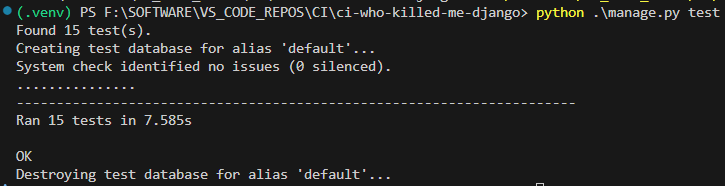

In future releases, I aim to implement comprehensive unit testing for the views in the `cheaterreport` and `userprofile` apps.

### Lighthouse Auditing

The "Lighthouse" tool built into Google Chrome DevTools was used to audit the performance, accessibility, best practices and SEO of the site.

Below are a few example audits for the "busiest" pages on the site:

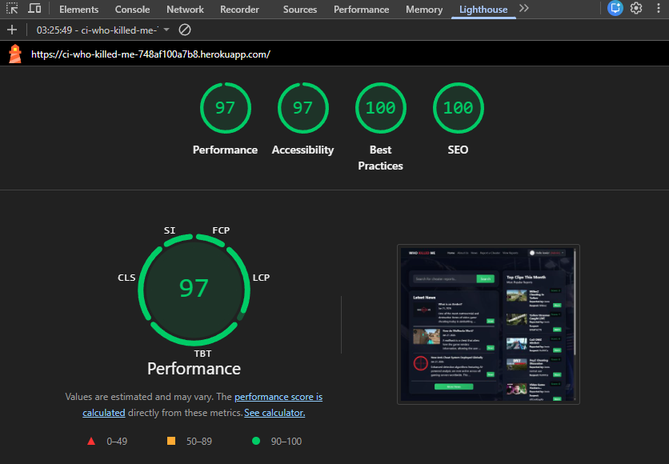
*Home Page Audit*

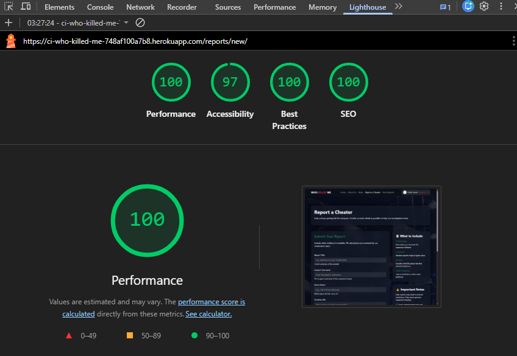
*New Report Page Audit*

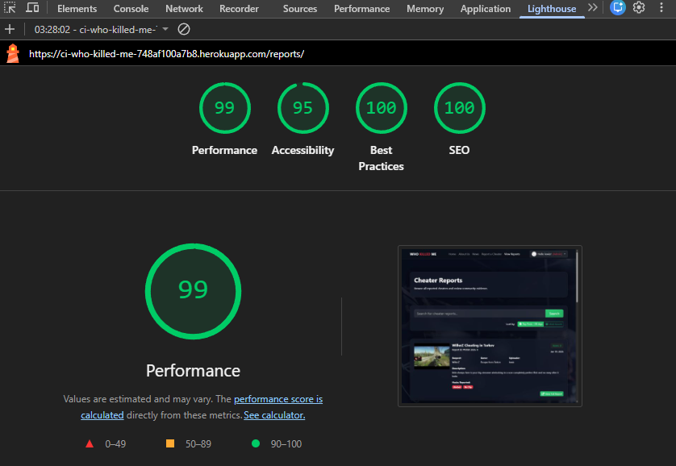
*Reports List Page Audit*

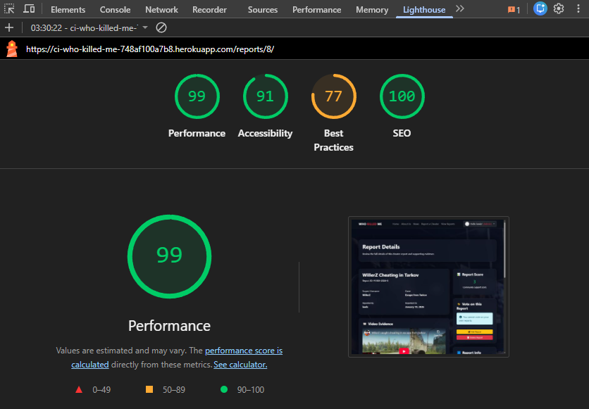
*Report Detail Page Audit*\
***NOTE**: The "Best Practices" score is much lower than average, due to the YouTube embed loading external cookies from YouTube.com. This is a notorious issue with YouTube's embedding process. The only non-workaround solution would be for Google to create a zero-tracking version of youtube specifically for embedding.*

Overall, Lighthouse was great for exposing any issues with my site that I may have missed during my initial implementation. Below are a couple of examples:

-   My initial implementation for fetching the thumbnail of a YouTube video used the regular YouTube domain. This meant that I was also having the above third-party cookies issue on any page that used YouTube video thumbnails. I switched this domain to the cookie-free `i.ytimg.com` domain, which uses zero tracking cookies.

Before & After (Click to Expand)

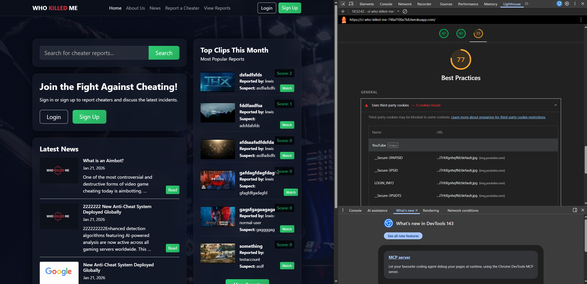

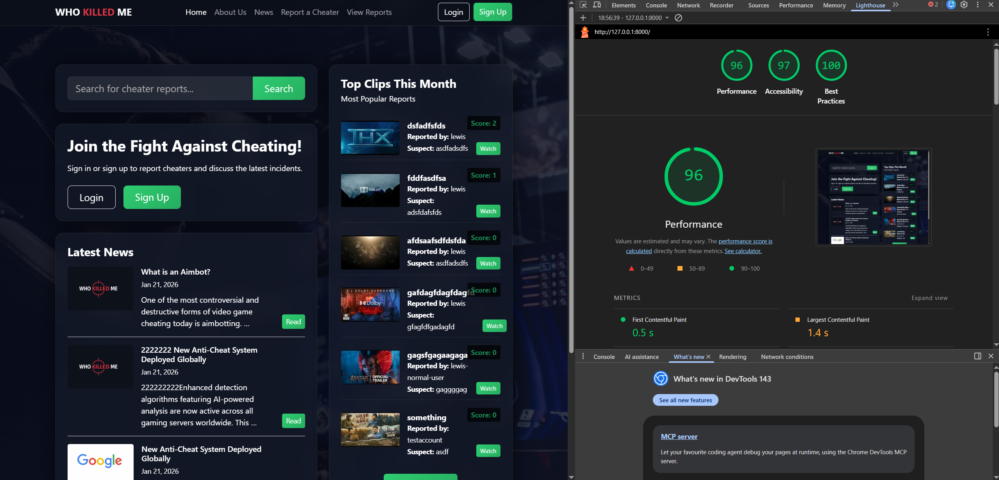

-   Initially my site has a poor SEO score due to missing a meta description tag. I added a general description meta tag to the base template, which would be used site-wide. In future releases, I aim to make this dynamic / per-page.

Before & After (Click to Expand)

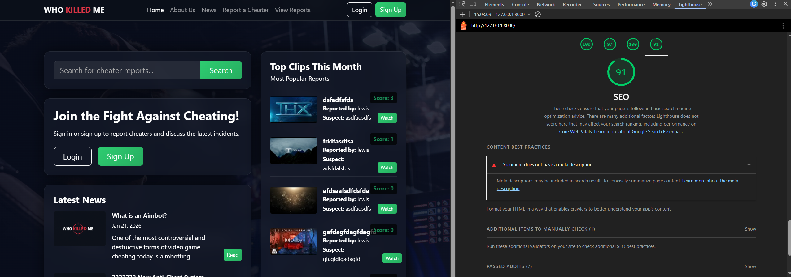

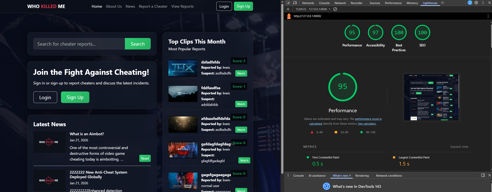

### Validation Testing - HTML

To validate my HTML, I used the [W3C Markup Validation Service](https://validator.w3.org/). This ensured my HTML was semantically correct, and followed best practices.

Whilst most of the pages passed with easily-fixable warnings, one recurring issue was due to the semantic use of header tags. Sometimes, I would skip over using an `<h3>` tag, and jump directly from an `<h4>`. Below is an example of me fixing this issue:

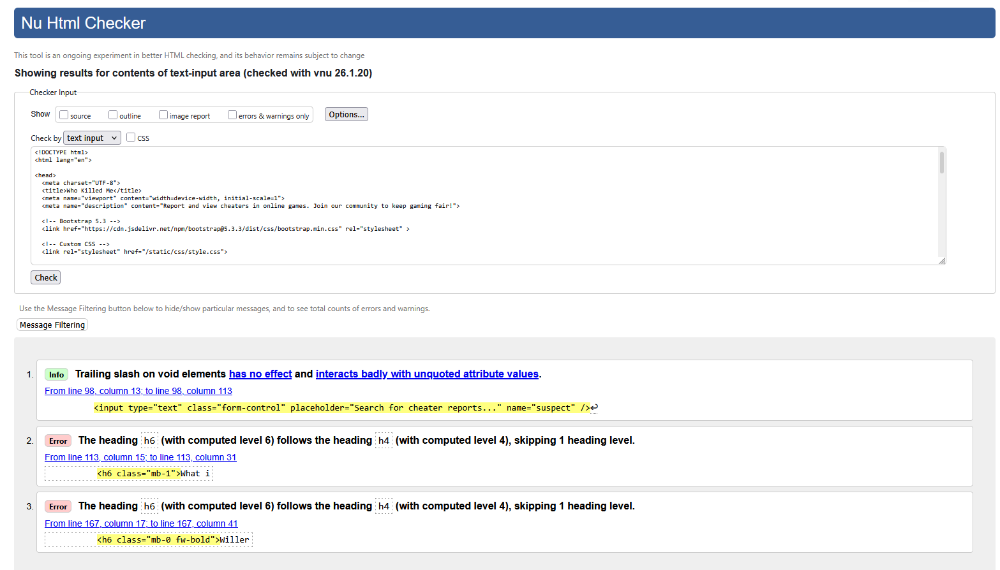
*1. Before Fix*

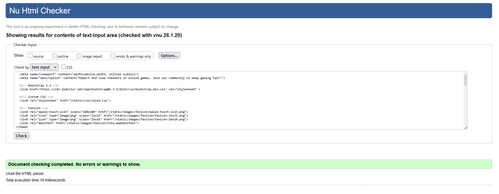
*2. After Fix*

### Validation Testing - CSS

To validate my CSS, I used the [W3C CSS Validation Service](https://jigsaw.w3.org/css-validator/). As my CSS was broken up into multiple files, then reimported into a globa / index stylesheet, I had to validate each file individually.

Below is an example screenshot from one of these files passing validation. Whilst there are a few warnings, these "Vendor Extensions" are added automatically by the "CSS Autoprefixer" tool that I use to ensure compatibility across different browsers, like Safari and Opera.

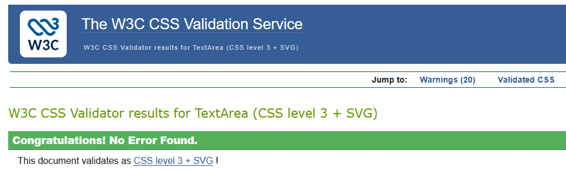
*1. Validation Result*

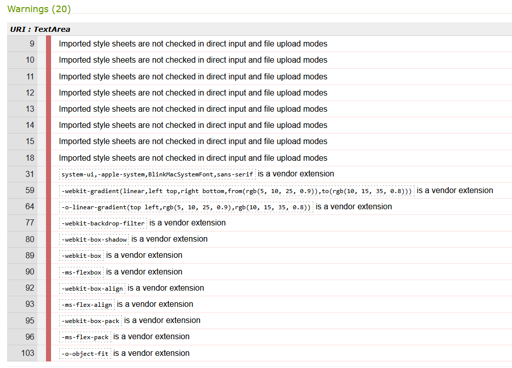
*2. Validation Warnings*

### Validation Testing - JavaScript

For certain functionality on the site, I needed to use JavaScript to provide real-time HTML updates without needing to refresh the page. This was required for form buttons becoming enabled when a user has a pending profile picture change, and better interactivity when a user wants to edit or delete their comment on a report. This functionality lies in the following files:

- `static/js/change_profile_picture.js`

- `static/js/comments.js`

To validate this Javascript, I used [JSValidator](https://jsvalidator.com/) to confirm there were no syntax errors or issues with the code. For linting and formatting my JavaScript, I used the [Prettier](https://prettier.io/) extension in VS Code.

Below are the JSValidator results for both files:

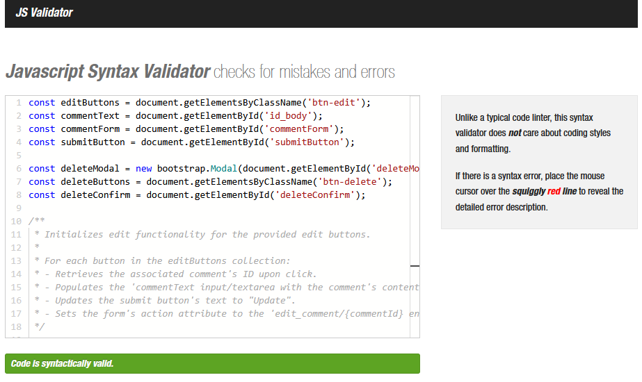
*1. Comments Javascript*

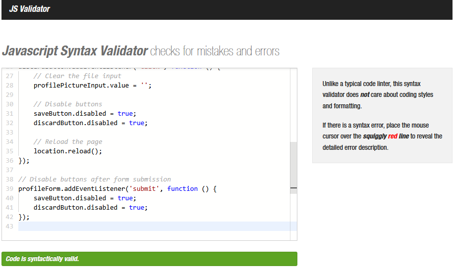
*2. Change Profile Picture Javascript*

### Validation Testing - Python

Python code must conform to "PEP 8" standards. For this, I used the [CI Python Linter](https://pep8ci.herokuapp.com/) tool provided by The Code Institute.

Rather than test this on every single Python file within the project (e.g. boilerplate code in settings, minimal `admin.py` files), I focused on the files that I had written the most code in. These files were my `views.py` files within each app.

Below are the results from the `views.py` file in the `about`, `cheaterreports`, `newsblog` and `userprofile` apps:

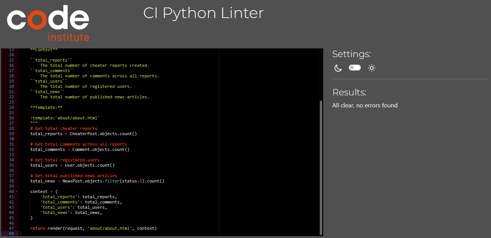
*1. About Python Validation*

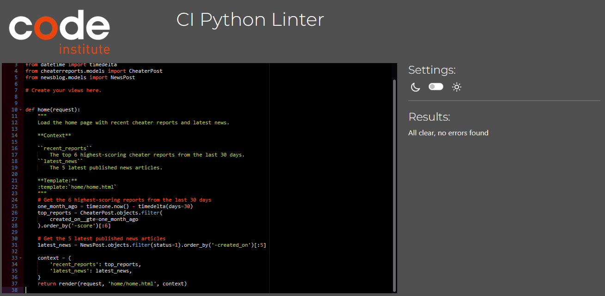
*2. Home Python Validation*

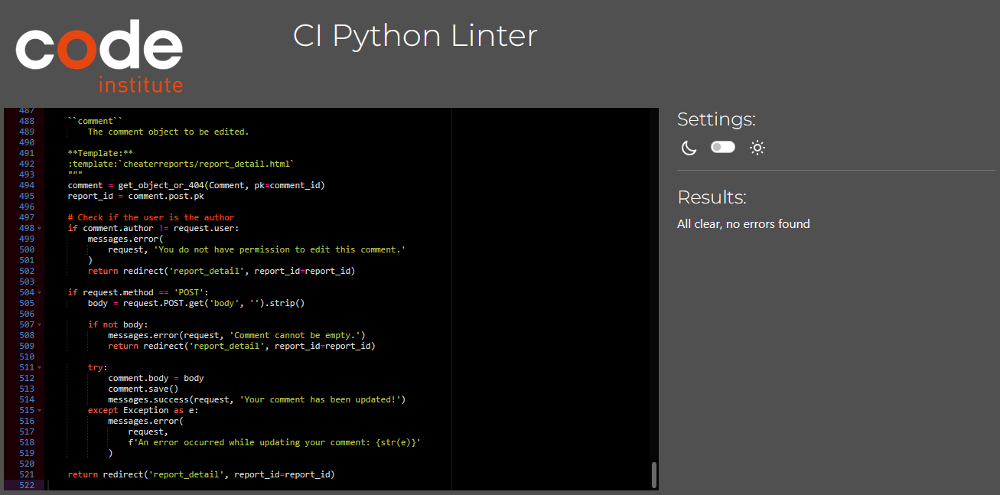
*3. Cheaterreports Python Validation*

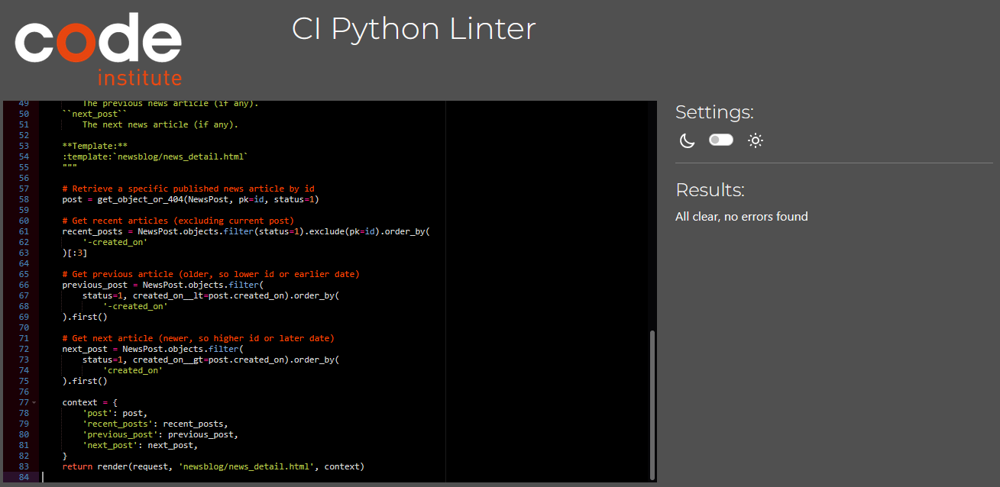
*4. Newsblog Python Validation*

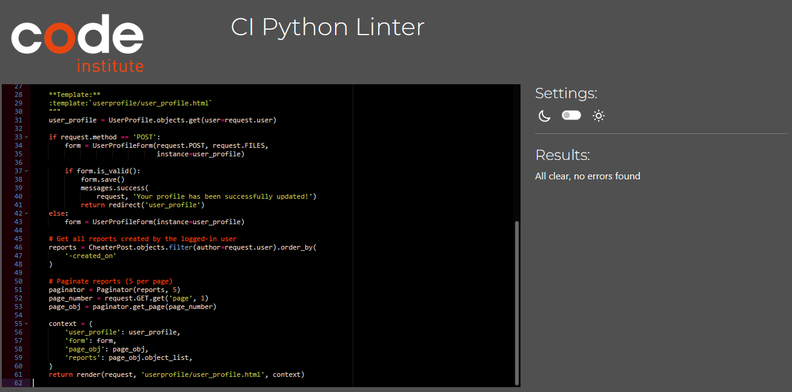
*5. Userprofile Python Validation*

## How AI Was Used in This Project

The use of generative AI tools were extremely useful; allowing me to create a responsive, complex site in a short amount of time. I ensured that I got the most value out of the tools available, implementing it in each phase of the project.

That said, especially during the coding phase, I would never let the AI write something that I didn't understand. If I didn't understand something, I would converse with it until I did. This ensured that I was still learning, and not just letting AI "do all the work" for me.

### Design

Whilst I was designing the wireframes for my site and getting ideas for the color pallette, I used [ChatGPT](https://chat.openai.com/) for helping with brainstorming. Based on my initial wireframes, I could ask it to generate mock-up images of certain pages, to see how it would interpret my designs.

Below is an example of ChatGPT generating a mock-up of the home page, which ended up **quite** close to how my MVP looked!

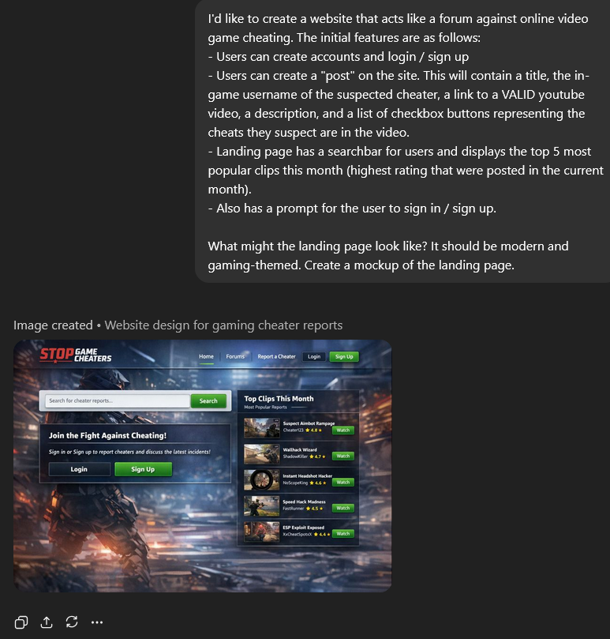

### Development

For the creation of certain features, I used the CoPilot extension in VS Code. If I was unsure on how to code something, or what syntax to use, I could ask the AI to generate the skeleton of the code for me, or just point me in the right direction.

A good example of this was when I was implementing the voting system for reports. I knew the general idea of how I wanted it to work, but I wasn't sure on the best way to structure the models and views to achieve this. I was able to talk it through with the AI to break down the problem (as I would pair programming with a human), and get suggestions on how to implement it.

Whilst AI was great for fleshing out an existing project, I would never let it touch any file relating to the foundation / configuration of the project. For example, if there was ever an issue I had to fix in `settings.py`, I would always check the documentation and fix it myself; as AI has a habit of suggesting deprecated code, or configuration snippets unrelated to what I want to achieve.

Finally, when I had similar code in another file that I had to bring over to a new file, but with slight modifications. CoPilot was able to recognize the similarities, and suggest the modified code for me, reducing a ~20 minute task to under a minute.

Below is a screenshot of this in action:

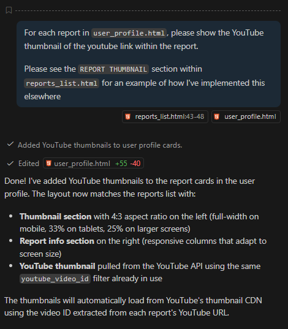

### Testing

CoPilot was handy for verifying and validating the code and features that I had implemented. On complex code, I could ask it to point out any potential edge-cases in my form validation, or security holes in my views. If it suggested something, I would try that edge-case manually to see if it was an actual issue, and fix as-needed.

CoPilot also helped me with my unit tests for the news blog feature. When I specifically had 3 unit tests failing, I asked CoPilot to investigate. It found that there was a race condition in the setup of my data, as I was testing something time-sensitive. It explained what was likely going wrong, and offered to fix it for me.

Below is a snippet of that conversation:

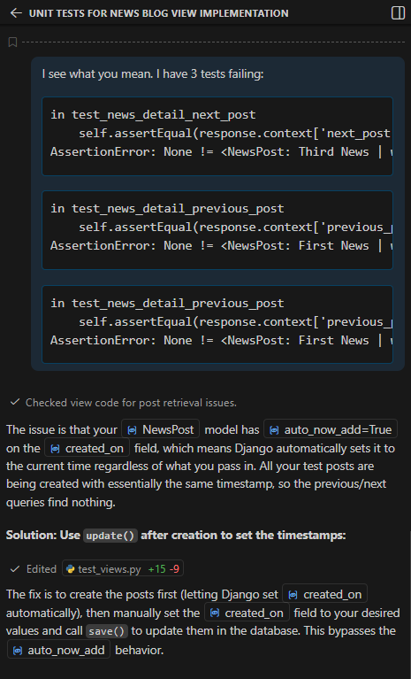

### Debugging

CoPilot was especially useful for debugging tricky issues when I had complex functionality.

For example, when I initially implemented the voting system, it appeared to work when I was doing everything via a single user. However, when I logged in as a different user, I noticed that the site thought I had already voted on a report, when I hadn't.

I debugged this manually using VSCode's step-through debugger, and I found the line that the issue was happening on. I then summarized and relayed this to CoPilot, and it suggested the actual fix for me.

Below is a screenshot of that conversation:

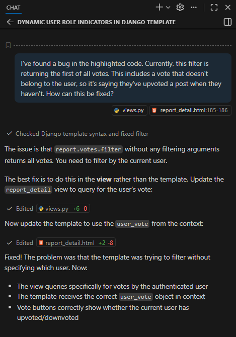

## Deployment

This project is currently using Heroku for deployment and hosting. The steps taken to deploy the project are as follows:

## Credits & Copyright
