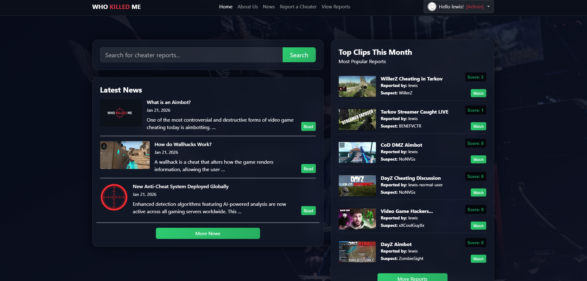
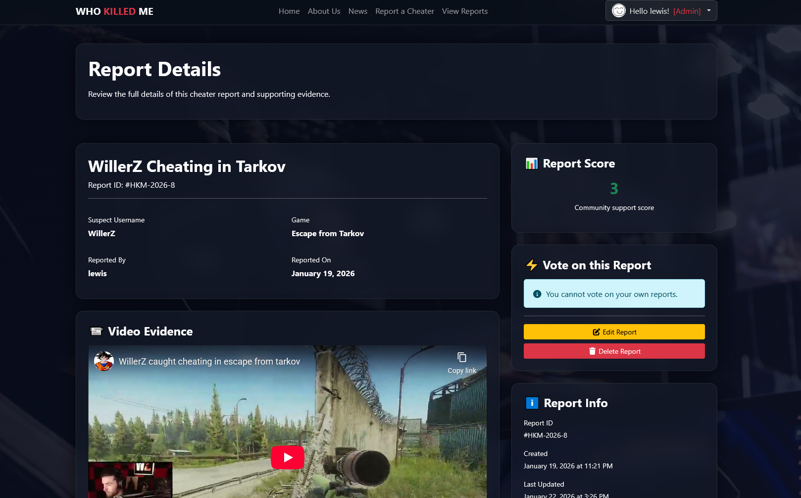
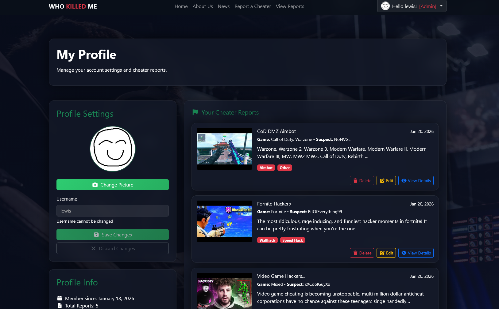
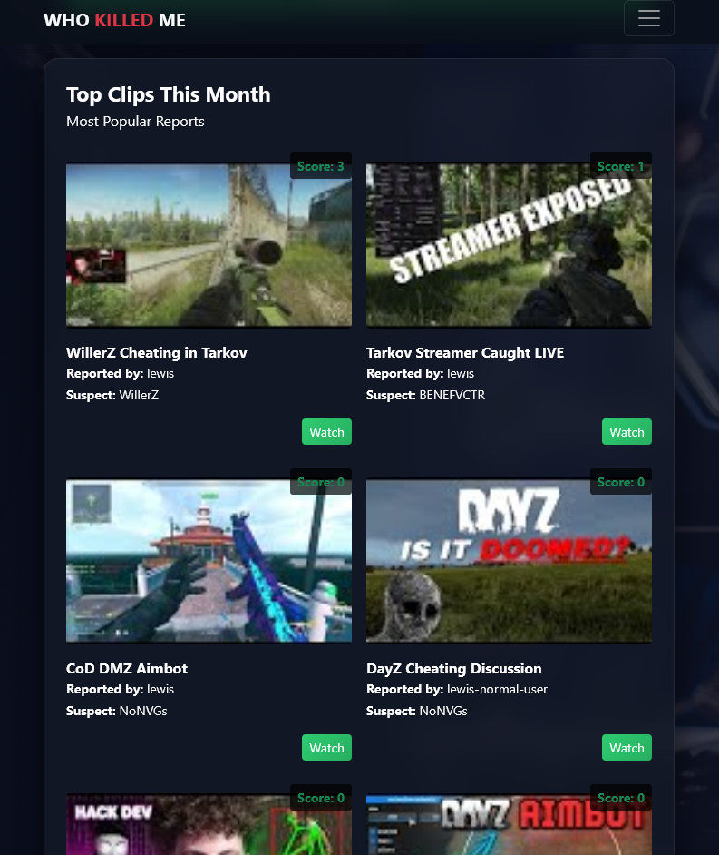
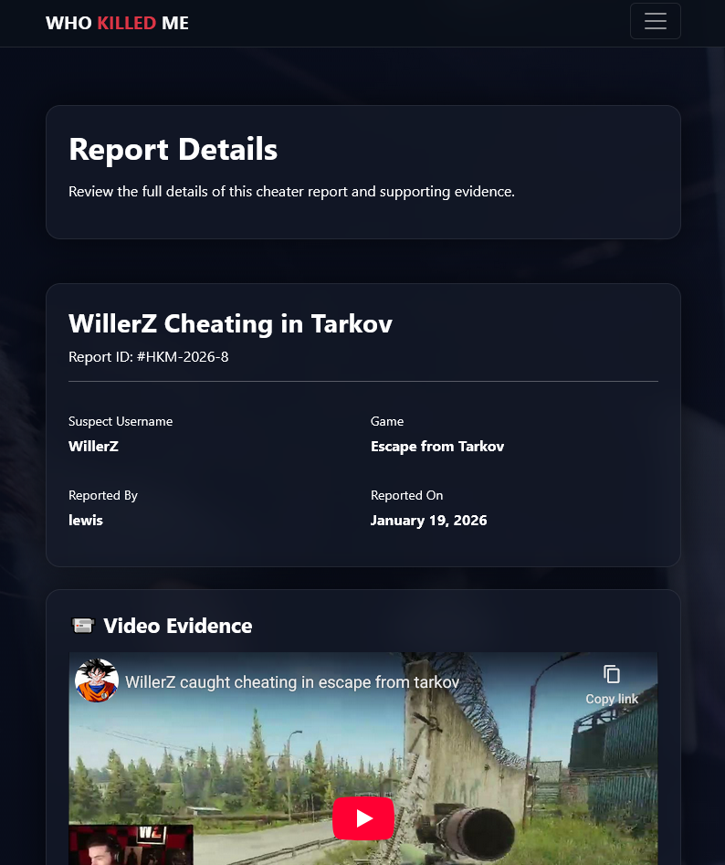
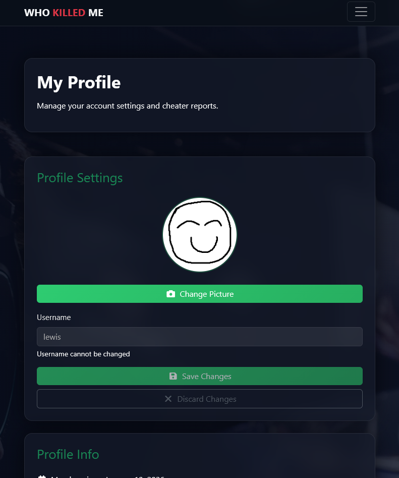
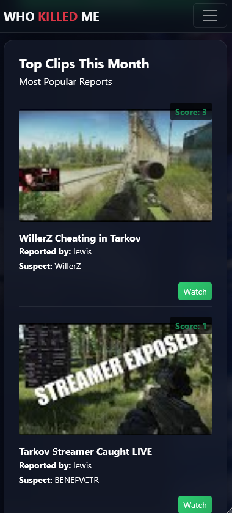
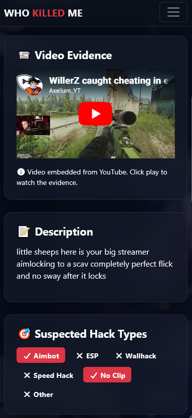
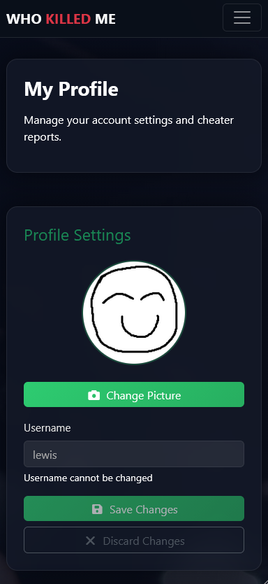
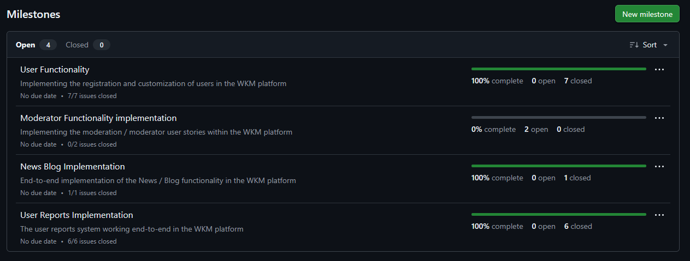

# Who Killed Me - An Online Forum to Report Cheating

## Table of Contents

Placeholder

## Introduction

"Who Killed Me" is an online forum dedicated to people pointing out when they have lost to a cheater in a video game. If the user can upload a YouTube video, they can create a post on the site, fill out some details about the incident, and share it with the community. Other users can then view the post, comment on it, and vote on whether they believe the report is valid.

The site also has a "News" section, where users can read articles about cheating in video games, updates on anti-cheat measures, and other related topics. These news articles are controlled and edited solely by site staff.

The platform was created in Django `6.0.1`, and built with Python `3.12.10`.

"Who Killed Me" can be accessed at: [https://ci-who-killed-me-748af100a7b8.herokuapp.com/](https://ci-who-killed-me-748af100a7b8.herokuapp.com/)

The GitHub Projects board for this project can be found at: [https://github.com/users/lewis1190/projects/9](https://github.com/users/lewis1190/projects/9)

## Preview Screenshots

### Desktop

Desktop Screenshot (click to expand)

### Tablet (Simulated on an iPad A16)

Tablet Screenshot (click to expand)

### Mobile (Simulated on an iPhone 12 Pro)

Mobile Screenshot (click to expand)

## Features

During this project, I wanted to implement the basic features of a forum website, along with some additional functionality to enhance the user experience. Whilst I was able to implement what I wanted for MVP, some features remain unimplemented, that I aim to design and implement properly in future updates.

### Existing Features

- **User Authentication:** Users can register for an account, log in, and log out. Passwords are securely hashed using Django's built-in authentication system.

- **Report Creation:** Authenticated users can create new reports about cheating incidents, including details such as the game, platform, description, and a YouTube video link.

- **Commenting System:** Users can comment on reports to discuss the incident, share their opinions, or provide additional information.
- **Voting System:** Users can upvote or downvote reports to indicate whether they believe the report is valid or not. The total score is displayed on the report page.

- **User Profiles:** Each user has a profile page displaying their reports. They can also update their profile picture.

- **News Section:** A dedicated section for news articles about cheating in video games, managed by site staff.

### Future Features

- **Moderation System:** Users can report posts or comments that violate the nature of the site. Moderators should be able to review these reports and take appropriate action, such as removing content or banning users / deleting accounts for repeated infractions.

  -   This feature was partially implemented, with users being able to be assigned "moderator" status through the admin panel, but no reporting system was created. Moderators will have a "[Mod]" badge next to their username when signed in.

- **Enhanced User Profiles:** Users could have more detailed profiles. I'd like them to have a bio, share their game profiles and also view their comment history.

- **Expanded filtering:** Users should be able to filter reports by game and platform.

## User Stories

User stories were grouped into milestones on GitHub. Each milestone would be represent a functional area of the site, as seen here:

Below is a full list of user stories that I created when planning this project. Each user story was expanded into a list of "Acceptance Criteria" and "Tasks" that must be satisfied to mark the story as complete.

For the full, expanded user stories, please see the [GitHub Projects board](https://github.com/users/lewis1190/projects/9) for this project.

- **User Functionality:**

  - As a new user, I want to create an account with a username and password so that I can access the forum.

  - As a superadmin, I want to access an admin panel so that I can manage users, roles, and system settings.

  - As a registered user, I want to log in with my credentials so that I can access my account.

  - As a logged-in user, I want to logout so that I can end my session and protect my account.

  - As a visitor, I want to see sign-in and sign-up options on the landing page so that I can easily create an account or log in.

  - As a logged-in user, I want to view my profile so that I can see my account information and my post history.

  - As the system, I want to assign user roles so that different users have appropriate access levels.

- **User Reports Implementation**

  - As a logged-in user, I want to create a post reporting a suspected cheater so that the community can review the evidence.

  - As a user, I want to view the complete details of a post so that I can see all the evidence and information about a reported cheater.

  - As a user, I want to search for posts about a specific in-game username so that I can find reports about particular players.

  - As a visitor, I want to see the top 5 most popular posts from the current month on the landing page so that I can quickly find trending reports.

  - As a logged-in user, I want to upvote or downvote posts so that I can indicate whether I find the report credible.

  - As a logged-in user, I want to comment on posts so that I can discuss the evidence and share opinions.

- **News Blog Implementation**

  -   As a site visitor, both logged in and not, I want to access the news reports that the site publishes.

- **Moderator Functionality Implementation**

  - As a moderator, I want to access a moderation panel so that I can review and manage user reports.

  - As a user, I want to report inappropriate posts or comments so that moderators can review them for violations.

## Planning / User Experience / UX Design

### Typography: Font Choices & Color Palette

### Wireframes

### Database Design

## Agile Project Management

### GitHub Projects Board

### GitHub Repo Branch Methodology

## Testing and Quality Assurance

### Ensuring Security

### Manual Testing

### Automated Testing - Unit Tests

### Lighthouse Auditing

### Validation Testing - HTML

### Validation Testing - CSS

### Validation Testing - JavaScript

### Validation Testing - Python

## How AI Was Used in This Project

## Deployment

## Credits
